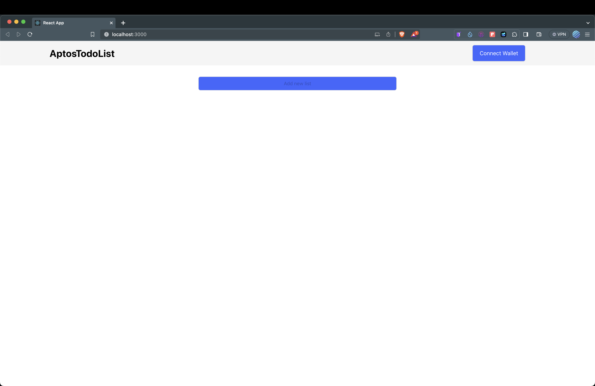
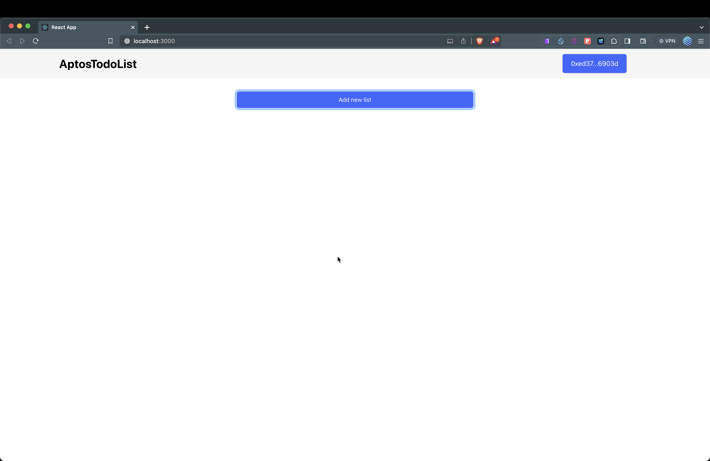
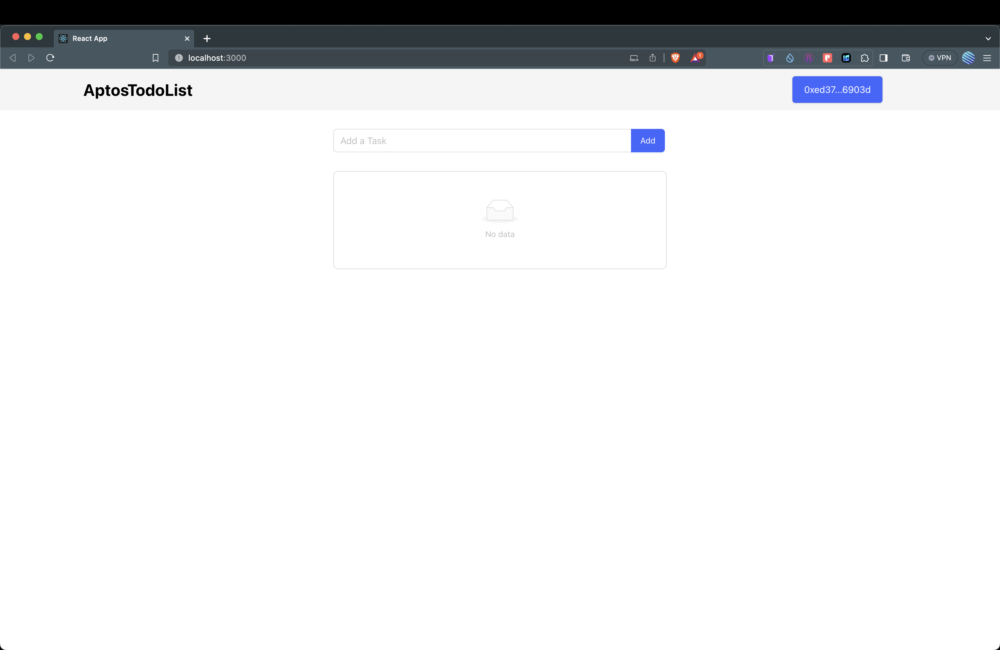
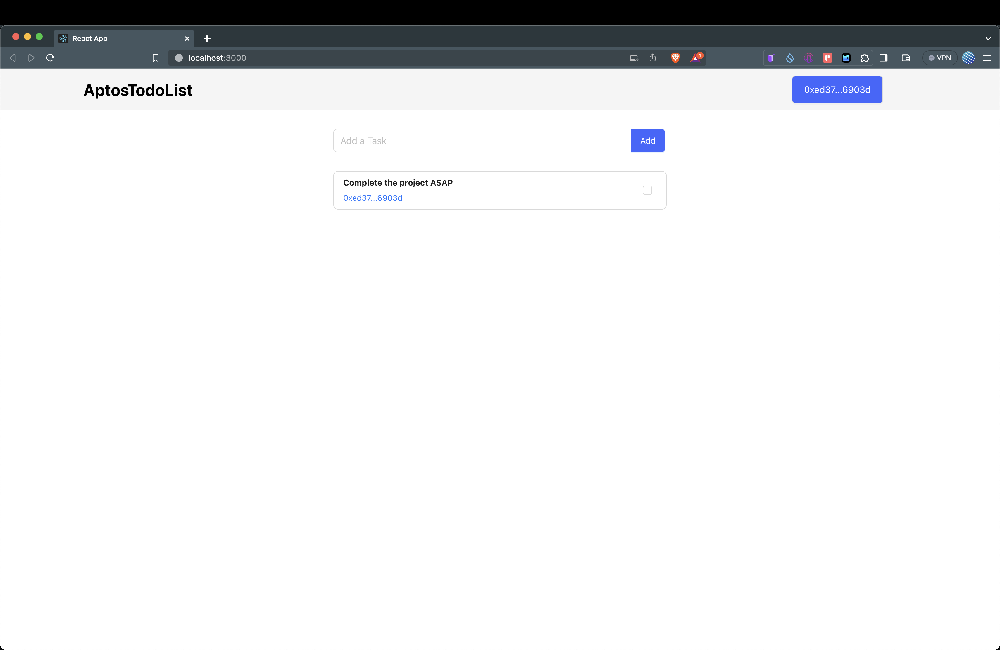
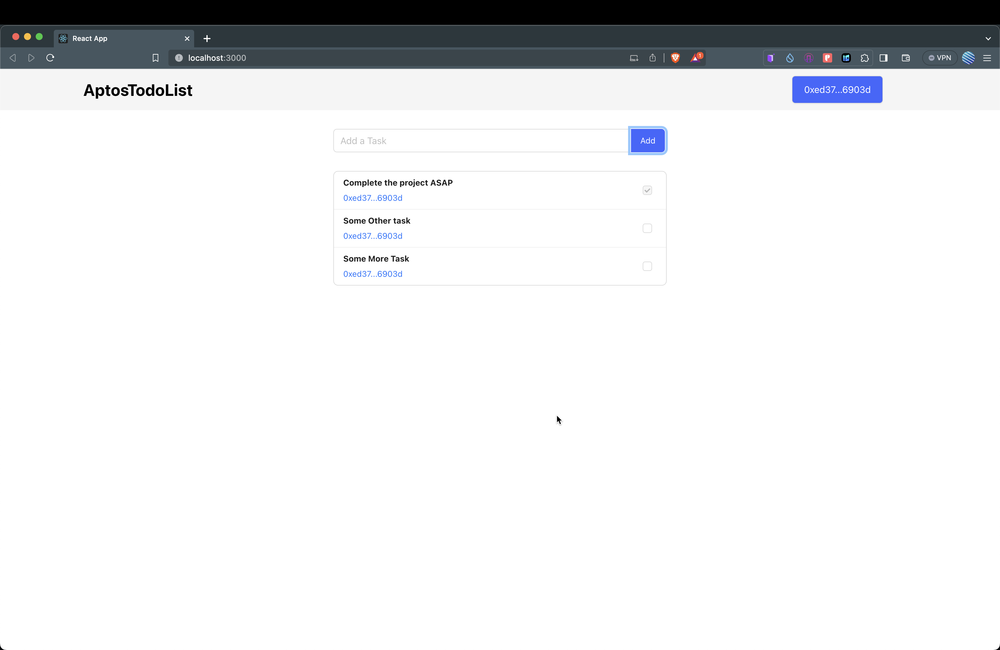

# AptosTodoList
AptosTodoList Dapp, created using [Aptos Documentation](https://aptos.dev/tutorials/build-e2e-dapp/e2e-dapp-index)

## How To Use the Dapp
1. Connect Your Petra Wallet using `Connect Wallet` Button and Approve.

2. Click on `Add new list` Button to create a new list for your account. Approve..

3. Add a New Task by writing the Text and clicking `Add`. Approve, voila done.

4. Now task is created, add more if you want.

5. Click on the checkbox to mark as completed, approve, and done.
